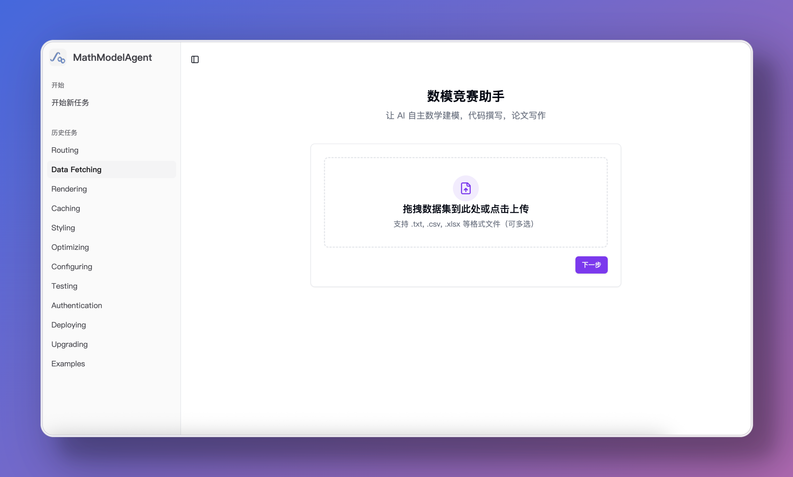
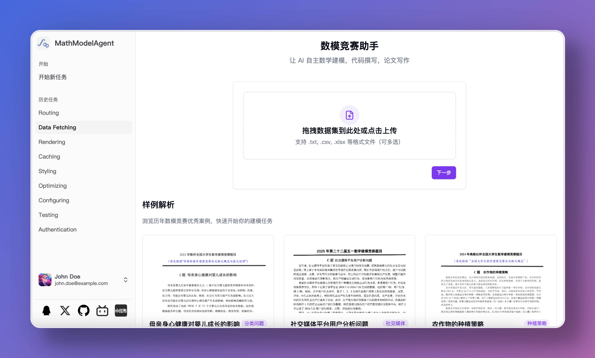
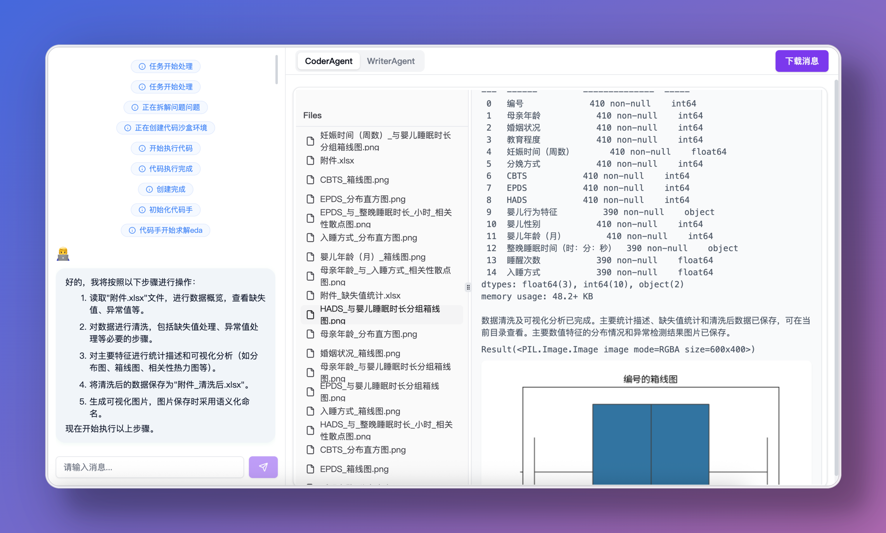
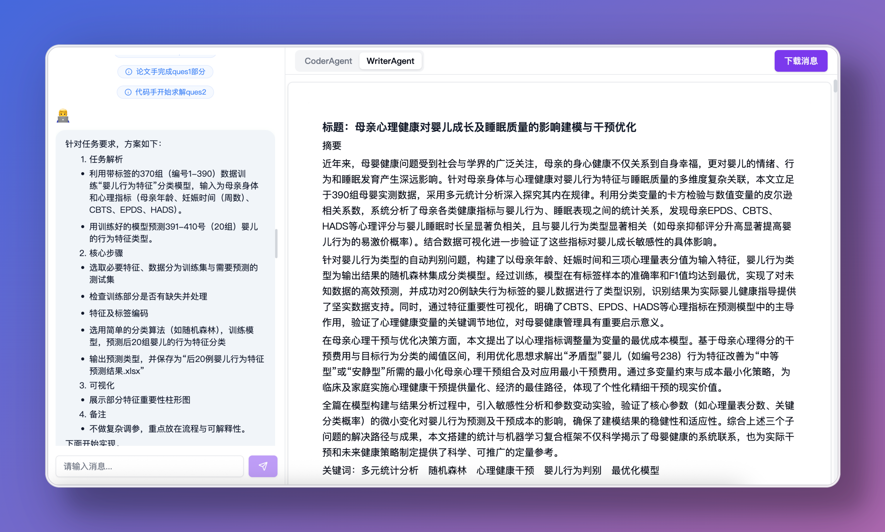
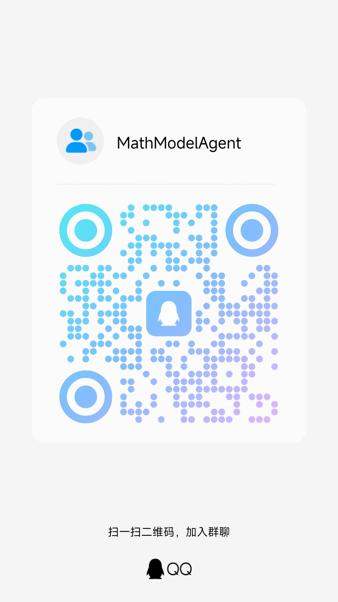

<h1 align="center">🤖 MathModelAgent 📐</h1>
<p align="center">
    
</p>
<h4 align="center">
    An agent designed for mathematical modeling<br>
    Automatically complete mathematical modeling and generate a ready-to-submit paper.
</h4>

<h5 align="center"><a href="README.md">简体中文</a> | English</h5>

## 🌟 Vision

Turn 3 days of competition into 1 hour <br>
Automatically generate an award-level modeling paper

<p align="center">
    
    
    
    
</p>

## ✨ Features

- 🔍 Automatic problem analysis, mathematical modeling, code writing, error correction, and paper writing
- 💻 Code Interpreter
    - Local Interpreter: Based on Jupyter, code saved as notebook for easy editing
    - Cloud Code Interpreter: [E2B](https://e2b.dev/) and [daytona](https://app.daytona.io/)
- 📝 Generate a well-formatted paper
- 🤝 Multi-agents: modeling expert, coding expert, paper expert, etc.
- 🔄 Multi-LLMs: Different models for each agent
- 🤖 Support for all models: [litellm](https://docs.litellm.ai/docs/providers)
- 💰 Low cost: workflow agentless, no dependency on agent framework
- 🧩 Custom templates: prompt inject for setting requirements for each subtask separately

## 🚀 Future Plans

- [x] Add and complete webui, cli
- [ ] Comprehensive tutorials and documentation
- [ ] Provide web service
- [ ] English support (MCM/ICM)
- [ ] LaTeX template integration
- [ ] Vision model integration
- [x] Proper citation implementation
- [x] More test cases
- [x] Docker deployment
- [ ] Human in loop: User interaction (model selection, @agent rewriting, etc.)
- [ ] Feedback: evaluate the result and modify
- [x] Cloud integration for code interpreter (e.g., e2b providers)
- [ ] Multi-language: R, Matlab
- [ ] Drawing: napki, draw.io, plantuml, svg, mermaid.js
- [ ] Add benchmark
- [ ] Web search tool
- [ ] RAG knowledge base
- [ ] A2A hand off: Code expert reflects on errors multiple times, hands off to smarter model agent

## Video Demo

<video src="https://github.com/user-attachments/assets/954cb607-8e7e-45c6-8b15-f85e204a0c5d"></video>

> [!CAUTION]
> The project is in experimental development stage, with many areas needing improvement and optimization. I (the project author) am busy but will update when time permits.
> Contributions are welcome.

For case references, check the [demo](./demo/) folder.
**If you have good cases, please submit a PR to this directory**

## 📖 Usage Guide

Three deployment options are available, choose the one that suits you best:
1. Docker
2. Local deployment
3. Automated script deployment

> If you want to run the CLI version, switch to the [master](https://github.com/jihe520/MathModelAgent/tree/master) branch. It's easier to deploy, but will not be updated in the future.

### 🐳 Option 1: Docker Deployment (Recommended: Simplest)

1. Configure Environment Variables

```bash
cp backend/.env.dev.example backend/.env.dev
cp frontend/.env.example frontend/.env.development
```

Fill in the configuration in:
- backend/.env.dev
- frontend/.env.development

2. Start Services

```bash
docker-compose up -d
```

3. Access

You can now access:
- Frontend interface: http://localhost:5173
- Backend API: http://localhost:8000

### 💻 Option 2: Local Deployment

> Make sure Python, Nodejs, and **Redis** are installed on your computer

1. Configure Environment Variables

Copy `/backend/.env.dev.example` to `/backend/.env.dev` (remove the `.example` suffix)

**Configure Environment Variables**

It is recommended to use models with strong capabilities and large parameter counts.

Copy `/frontend/.env.example` to `/frontend/.env.development` (remove the `.example` suffix)

2. Install Dependencies

Clone the project

```bash
git clone https://github.com/jihe520/MathModelAgent.git
```

Start backend

*Start Redis*

```bash
cd backend
pip install uv # Recommended: use uv to manage python projects
uv sync # Install dependencies
# Start backend
# Activate Python virtual environment
source .venv/bin/activate # MacOS or Linux
venv\Scripts\activate.bat # Windows
# Run this command for MacOS or Linux
ENV=DEV uvicorn app.main:app --host 0.0.0.0 --port 8000 --ws-ping-interval 60 --ws-ping-timeout 120 --reload
# Run this command for Windows
set ENV=DEV ; uvicorn app.main:app --host 0.0.0.0 --port 8000 --ws-ping-interval 60 --ws-ping-timeout 120
```

Start frontend

```bash
cd frontend
npm install -g pnpm
pnpm i # Make sure pnpm is installed
pnpm run dev
```

[Tutorial](./docs/md/tutorial.md)

Results and outputs are generated in the `backend/project/work_dir/xxx/*` directory:
- notebook.ipynb: code generated during execution
- res.md: final results in markdown format

### 🚀 Option 3: Automated Script Deployment (Community Contribution)
Need an automatic deployment script?
[mmaAutoSetupRun](https://github.com/Fitia-UCAS/mmaAutoSetupRun)

Need to customize prompt templates?
Prompt Inject: [prompt](./backend/app/config/md_template.toml)

## 🤝 Contribution & Development

[DeepWiki](https://deepwiki.com/jihe520/MathModelAgent)

- The project is in **experimental development stage** (updated when I have time), with frequent changes and some bugs being fixed.
- Everyone is welcome to participate and make the project better.
- PRs and issues are very welcome.
- For requirements, refer to Future Plans.

After cloning the project, install the **Todo Tree** plugin to view all todo locations in the code.

`.cursor/*` contains overall architecture, rules, and mcp for easier development.

## 📄 License

Free for personal use. For commercial use, please contact me (the author).

[License](./docs/md/License.md)

## 🙏 Reference

Thanks to the following projects:
- [OpenCodeInterpreter](https://github.com/OpenCodeInterpreter/OpenCodeInterpreter/tree/main)
- [TaskWeaver](https://github.com/microsoft/TaskWeaver)
- [Code-Interpreter](https://github.com/MrGreyfun/Local-Code-Interpreter/tree/main)
- [Latex](https://github.com/Veni222987/MathModelingLatexTemplate/tree/main)
- [Agent Laboratory](https://github.com/SamuelSchmidgall/AgentLaboratory)

## Others

### 💖 Sponsor

[Buy Me a Coffee](./docs/sponser.md)

Thanks to sponsors:
[danmo-tyc](https://github.com/danmo-tyc)

### 👥 GROUP

For questions, join the group

[QQ Group: 699970403](http://qm.qq.com/cgi-bin/qm/qr?_wv=1027&k=rFKquDTSxKcWpEhRgpJD-dPhTtqLwJ9r&authKey=xYKvCFG5My4uYZTbIIoV5MIPQedW7hYzf0%2Fbs4EUZ100UegQWcQ8xEEgTczHsyU6&noverify=0&group_code=699970403)

<div align="center">
    
</div>
